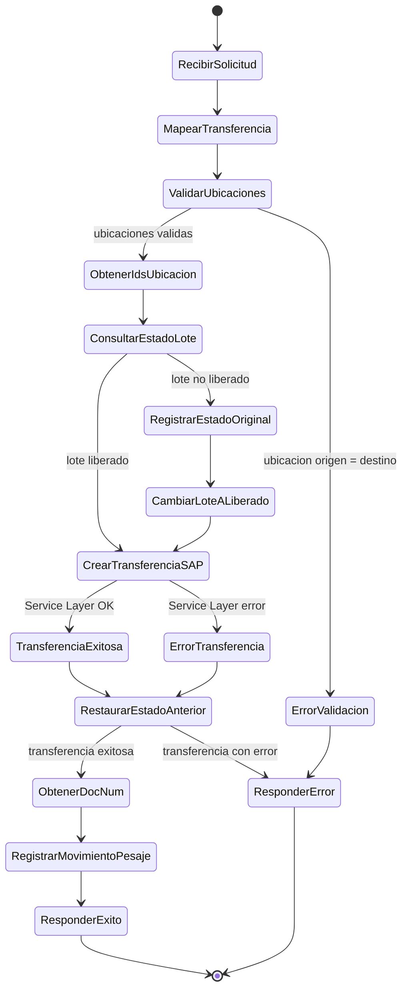

# Diagrama de estado: cambio de estado de lote durante transferencia

## Flujo

1. Se recibe el payload de `api/tsFromPesajeToMat`.
2. Se mapea a una transferencia entre ubicaciones.
3. Se valida que la ubicacion origen no sea igual a la ubicacion destino.
4. Se obtienen los IDs internos de las ubicaciones para `BinAbsEntry`.
5. Se consulta el estado actual del lote.
6. Si el lote no esta liberado, se guarda el estado original y se cambia temporalmente a liberado.
7. Se crea la transferencia en SAP por Service Layer.
8. Se restaura el estado original del lote.
9. Si la transferencia fue exitosa, se obtiene el `DocNum` y se registra el movimiento de pesaje.
